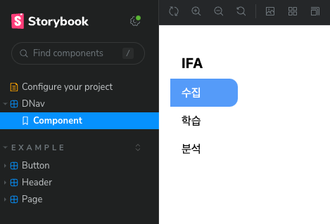

설치

```
npx storybook@latest init --type vue3 --builder vite
```

실행하면 아래와 같은 애러가 뜬다.

```
[Error] Loading PostCSS Plugin failed: Cannot find module 'tailwindcss'
```

postcss.config.js 를 만들어야 로드를 할수 있다.

postcss.config.js

```
module.exports = {
  plugins: {
    tailwindcss: {},
    autoprefixer: {},
  },
};
```

Tailwind CSS를 정의한 CSS 파일을 로드도 해줘야 한다.

.storybook/preview.js

```
import "../assets/css/main.css";
...
```

vueAPI를 자동으로 가져온다고 하는데 이것도 깔아주자.

```
npm i -D unplugin-auto-import
```

Storybook에서도 자동 임포트되는 함수 등을 읽을 수 있도록 합니다.

.storybook/main.js

```
const AutoImport = require("unplugin-auto-import/vite");

...

viteFinal: async (config) => {
    if (config.plugins !== undefined) {
     config.plugins.push(
       AutoImport({ imports: ["vue"], dts: ".storybook/auto-imports.d.ts" })
     );
   }
   return {
     ...config,
     define: {
       ...config.define,
       global: "window",
     },
   };
 },
```

nuxt 구성 요소의 자동 가져오기

```
npm i -D unplugin-vue-components
```

Storybook에서도 자동 임포트되는 함수 등을 읽을 수 있도록

```
const AutoImportComponents = require("unplugin-vue-components/vite");

...

viteFinal: async (config) => {
    if (config.plugins !== undefined) {
      config.plugins.push(
        AutoImport({ imports: ["vue"], dts: ".storybook/auto-imports.d.ts" })
      );
+     config.plugins.push(
+       AutoImportComponents({
+         dirs: ["components"],
+         directoryAsNamespace: false,
+         dts: ".storybook/components.d.ts",
+       })
+     );
+   }
    return {
      ...config,
      define: {
        ...config.define,
        global: "window",
      },
    };
  },
```

fontawesome 적용

.storybook/preview.js

```
import { library } from "@fortawesome/fontawesome-svg-core";
import { fas } from "@fortawesome/free-solid-svg-icons";

library.add(fas);
```

위에서 설정한 `AutoImport` 는 에러가 떠서 그냥 다 지우고 아래와 같이 설정함

vite.config.ts

```
import { URL, fileURLToPath } from "node:url";
import { defineConfig } from "vite";
import AutoImport from "unplugin-auto-import/vite";
import Components from "unplugin-vue-components/vite";
import vue from "@vitejs/plugin-vue";

// https://vitejs.dev/config/
export default defineConfig({
  plugins: [
    vue(),
    AutoImport({
      imports: ["vue", "vue-router"],
      dirs: ["./composables"], // Point to your composables directory that is auto-imported
      vueTemplate: true,
    }),
    Components({
      dirs: ["./components/"], // Point to your components directory that is auto-imported
      dts: true,
      directoryAsNamespace: true,
    }),
  ],
  resolve: {
    alias: {
      "~": fileURLToPath(new URL("../hex-blog-src/", import.meta.url)),
      // Add any other aliases you use in your code base
      // https://nuxt.com/docs/api/configuration/nuxt-config/#alias
    },
  },
});

```

감격 스럽게도 이제서야 된다.


